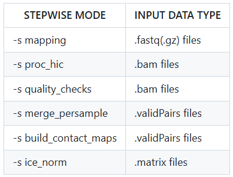

# From raw fastq to contact matrix
## Step1 数据质检与预处理 
### Fastqc
```
fastqc 0.0rawdata/SAMPLE.R*.fastq.gz -o 0.0rawdata_QC/ >> 0.0rawdata_QC/qc.log
```
### Remove low-quality reads & adaptors
```
cutadapt -j 40 -a adapter -A adapter --trim-n -m 50 -q 20,20 -o 0.1clean_data/SAMPLE.R1.fastq.gz -p 0.1clean_data/SAMPLE.R2.fastq.gz 
0.0rawdata/SAMPLE.R1.fastq.gz 0.0rawdata/SAMPLE.R2.fastq.gz > 0.1clean_data/logs/SAMPLE.cutadapt.log
```
### Cleandata fastqc
```
fastqc 0.1clean_data/SAMPLE.R*.fastq.gz -o 0.1cleandata_QC/ >> 0.1cleandata_QC/qc.log`
```

## Step2 比对并获得互作矩阵
使用HiC-Pro对双端测序数据进行比对和处理，具体的流程、原理和软件使用配置请参考文献和manual [HiC-Pro Github](https://github.com/nservant/HiC-Pro)

### software
```
HiC-Pro v2：/usr/local/software/HiC_Pro2/HiC-Pro_2.11.4/bin/HiC-Pro 
HiC-Pro v3：/usr/local/software/HiC-Pro-3.1.0/bin/HiC-Pro 
```
### Annotation files
1. A BED file of the restriction fragments after digestion.\
DpnII/HindIII/MboI digestion site files for human and mouse in /home/share/HiC-Pro-annotations/ \
其他情况可使用digest_genome.py函数制备酶切位点文件(可接受多酶切位点)
~~~
python /usr/local/software/HiC-Pro-3.1.0/bin/utils/digest_genome.py -r MboI,HindIII /home/share/fasta_home/mm10.fa -o mm10_MboI_HindIII.bed
~~~
2. A table file of chromosomes' size 
~~~
Chr_Size_Dir=/home/share/HiC-Pro-annotations
~~~
3. The bowtie2 indexes 
~~~
Bowtie2_Idx_Dir=/home/share/bowtie2_index
~~~
### Prepare HiC-pro configuration file: config-hicpro.txt
HiC-Pro的所有参数都配置在config-hicpro.txt中，具体各参数的含义请参照示例文件和manual [HiC-Pro Manual](https://github.com/nservant/HiC-Pro/blob/master/doc/MANUAL.md)
### Input files
**根据输入文件名的_R1或.R1修改config文件的PAIR1_EXT参数** \
输入文件存放格式：
~~~
    + Input_Dir
      + sample1
       ++ file1_R1.fastq.gz
       ++ file1_R2.fastq.gz
       ++ ...
     + sample2
       ++ file1_R1.fastq.gz
       ++ file1_R2.fastq.gz
     *...
~~~
### Run HiC-Pro
~~~
HiC-Pro -i Input_Dir/ -o Output_Dir -c config-hicpro.txt
~~~
### Results
~~~
    + bowtie_results/
      + bwt2
        ++ bwt2_global/ 
        ++ bwt2_local/ 
    + hic_results/
      + data/ 
      + matrix/ 
      + pic/
      + stats/
~~~
HiC-Pro总流程运行的结果按分步骤放在不同文件夹中，建议运行一次后一个个查看，重要的结果文件有：
+ validPairs: 每组双端测序数据得到的contact pairs
+ allValidPairs: 每sample合并所有生物学或技术重复后，并去除PCR duplicates后的contact pairs
+ matrix: 根据给定的resolution得到的长格式的矩阵文件
+ iced.matrix: 对raw matrix做ICE normalize
+ abs.bed: 特定resolution下，每个bin的index（只与resolution和chromosome size有关）
+ 其他一些stats文件：统计了比对率、contact数量、PCR duplicates数量等统计日志
+ Mapping结果bam文件非常庞大，**建议删除**
+ **Hic-pro支持multiqc进行结果统计**
### Run HiC-Pro Per step
HiC-Pro是一整套包括mapping, filtering, quality checks, merge and remove duplicates, build matrix 和 ICE normalize的处理流程，
其中各个步骤可以单独运行，使用**HiC-Pro -s ANALYSIS_STEP -i 上一步所得结果** 运行。\
比如合并多次测序的contact pairs，可将多次测序的validPairs放在同一文件夹，运行-s merge_persample \
 \
HiC-Pro分步运行仍使用configuration文件配置参数。不过每一步运行的脚本和代码都记录在run.log中，因此在处理一些复杂情况时，可参照run.log中的脚本运行需要的步骤。建议仔细查看此日志。
### Matrix与normalization
+ 因为远端互作一般很少，在一个正方形的互作热图上很多是空白，因此HiC-Pro使用长格式的稀疏矩阵记录基因组上各个bin之间的互作数。即第一、二列分别表示两个位置，第三列表示这两个位置的互作数。在一个bed文件中记录了在这种分辨率下每个位置表示的哪条染色体的哪个区域。可以通过脚本或R语言将这种格式与正方形matrix之间转换。
+ Hi-C数据的normalization方法有很多种，并且一直有新的研究发表。建议通过综述了解。
+ HiC-Pro运行了ICE normalization，对互作数进行校正，结果格式与raw matrix相同。但没有对文库大小进行校正，建议在处理和分析前对互相比较的样本间数据量downsample到一致的水平。
+ 其他软件，如[HiCExplorer](https://hicexplorer.readthedocs.io/en/latest/)也推荐尝试。
