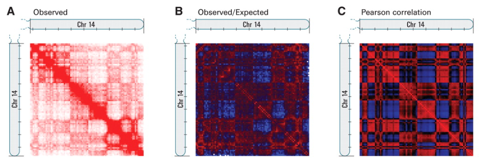

### Tips
+ 在一条染色体中，对各个位置与其他位置之间的互作数做相关性分析，可得到每两个位置之间的相关性，相关性为正和为负的区域一般会分隔成几Mb以上大小的区室;
+ 同理在一条染色体中，对各个位置与其他位置之间的互作数做PCA分析，可得到每个位置的第一主成分PC1，研究发现PC1值正负符号可将染色质分为active和inactive两类，与染色质marker较好的对应。因此将通过其他活性或抑制性marker将它们分为compartment A和compartment B；
+ 根据以上原理，可用计算PCA的方法自编脚本计算PC1。或推荐使用Homer软件计算；
+ 需要注意的是，某些物种比如**human**染色体长短臂间互作少，可能计算得到的PC1以长短臂区分符号，因此可使用**PC2**的符号鉴别compartment。
### A/B区室
\
*Lieberman-Aiden E, van Berkum NL, Williams L, et al. Comprehensive mapping of long-range interactions reveals folding principles of the human genome. Science. 2009;326(5950):289-293.*\
在这篇最早发表的文章中，作者发现把Hi-C结果标准化后，出现了区别非常明显的格子形状（c图）。将数据用PCA降维后，出现了AB两个主成分，一个是正的一个是负的，即A/B compartment。其中正的为A，负的为B：
+ A compartments：开放的染色质，表达活跃，基因丰富，具有较高的GC含量，包含用于主动转录的组蛋白标记，通常位于细胞核的内部。
+ B compartments：关闭的染色质，表达不活跃，基因缺乏，结构紧凑，含有基因沉默的组蛋白标志物，位于核的外围。
### Compartment-Homer
[HOMER runHiCpca](http://homer.ucsd.edu/homer/interactions2/HiCpca.html)
#### Step1 ValidPair文件提取
~~~
#Homer软件只需要validPair的前7列
awk 'BEGIN{FS=OFS="\t"} {print $1,$2,$3,$4,$5,$6,$7}' HicPro_Output/hic_results/data/SAMPLE/SAMPLE.allValidPairs > Compartment/01.hicpro2homer/SAMPLE.homer
~~~
#### Step2 makeTagDirectory 
~~~
makeTagDirectory 02.makeTagDirectory/tag_SAMPLE -format HiCsummary 01.hicpro2homer/SAMPLE.homer
~~~
#### Step3 calculate PC1 value
~~~
res=40000
window=200000 Equal to or larger than -res
runHiCpca.pl 03.HiCpca/SAMPLE 02.makeTagDirectory/tag_SAMPLE/ -res $res -window $window -cpu 10 -genome mm10 > 03.HiCpca/HiCpca.log
#-genome 默认TSS文件作为active区, 可使用-active K27ac.peaks.bed 替换-genome mm10
~~~
#### Results
~~~
    + SAMPLE.PC1.bedGraph
    + SAMPLE.PC1.txt
~~~
#### Checkerboard Pattern View
```
for i in {1..19} X;do chr=chr${i};
analyzeHiC 02.makeTagDirectory/tag_SAMPLE -res $res -window $window -cpu 5 -corr -distNorm -chr $chr
-o 04.analyzeHiC/SAMPLE_${chr}_$res.corr_distNorm.txt > 
04.analyzeHiC/SAMPLE_${chr}_$res.analyzeHic.corr_distNorm.log;
done
``` 
[可视化软件 TreeView](https://bitbucket.org/TreeView3Dev/treeview3/src/master/)

