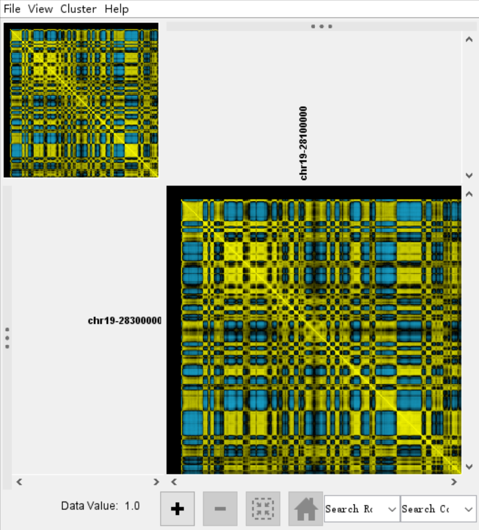

### Tips
+ 在一条染色体中，对各个位置与其他位置之间的互作数做相关性分析，可得到每两个位置之间的相关性，相关性为正和为负的区域一般会分隔成几Mb以上大小的区室;
+ 同理在一条染色体中，对各个位置与其他位置之间的互作数做PCA分析，可得到每个位置的第一主成分PC1，研究发现PC1值正负符号可将染色质分为active和inactive两类，与染色质marker较好的对应。因此将通过其他活性或抑制性marker将它们分为compartment A和compartment B；
+ 根据以上原理，可用计算PCA的方法自编脚本计算PC1。或推荐使用Homer软件计算。
+ 需要注意的是，某些物种比如human染色体长短臂间互作少，可能计算得到的PC1以长短臂区分符号，因此可使用PC2的符号鉴别compartment
### Compartment-Homer
[HOMER runHiCpca](http://homer.ucsd.edu/homer/interactions2/HiCpca.html)
### Step1 ValidPair文件提取
Homer软件只需要validPair的前7列 \
`awk 'BEGIN{FS=OFS="\t"} {print $1,$2,$3,$4,$5,$6,$7}' SAMPLE.allValidPairs > 01.hicpro2homer/SAMPLE.homer`
### Step2 makeTagDirectory 
`makeTagDirectory 02.makeTagDirectory/tag_SAMPLE -format HiCsummary $i`
### Step3 calculate PC1 value
~~~
res=40000
window=200000 Equal to or larger than -res
runHiCpca.pl 03.HiCpca/SAMPLE 02.makeTagDirectory/tag_SAMPLE/ -res $res -window $window -cpu 10 -genome mm10 > 03.HiCpca/SAMPLE/HiCpca.log` \
-genome 默认TSS文件作为active区, 可使用-active K27ac.peaks.bed 替换-genome mm10
~~~
### Results
~~~
    + SAMPLE.PC1.bedGraph
    + SAMPLE.PC1.txt
~~~
### checkerboard pattern view
```
for i in {1..19} X Y;do chr=chr${i};
analyzeHiC 02.makeTagDirectory/tag_SAMPLE -res $res -window $window -cpu 5 -corr -distNorm -chr $chr
-o analyzeHiC/SAMPLE/SAMPLE_${chr}_$res.corr_distNorm.txt > 
analyzeHiC/SAMPLE/SAMPLE_${chr}_$res.analyzeHic.corr_distNorm.log;
done
``` 
[可视化软件 TreeView](https://bitbucket.org/TreeView3Dev/treeview3/src/master/)

