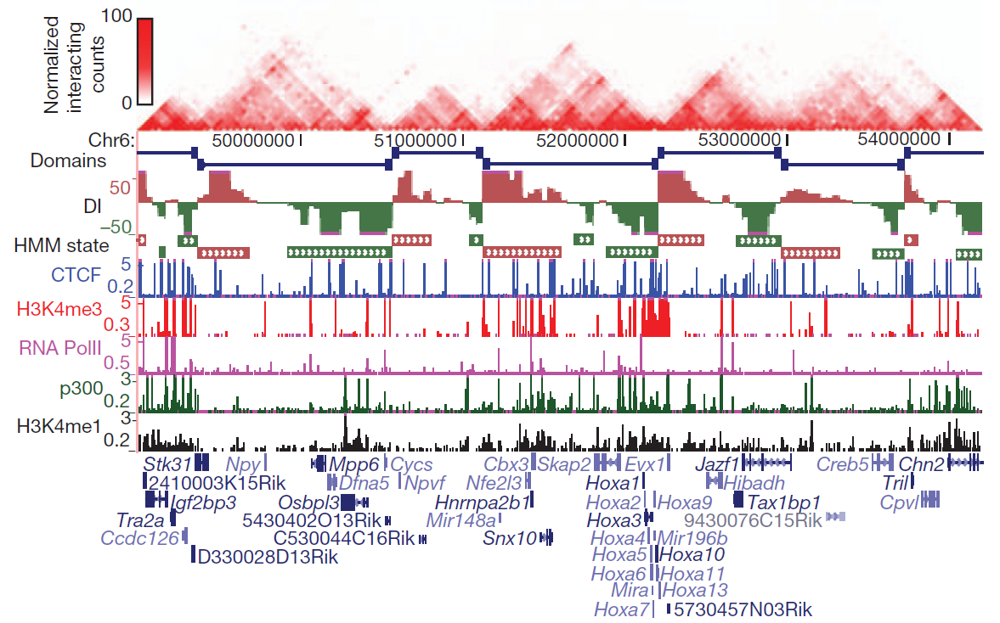
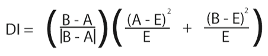
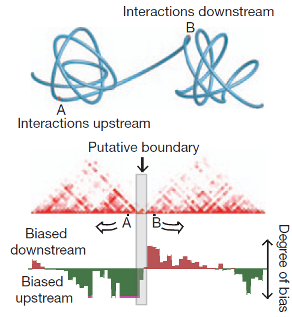
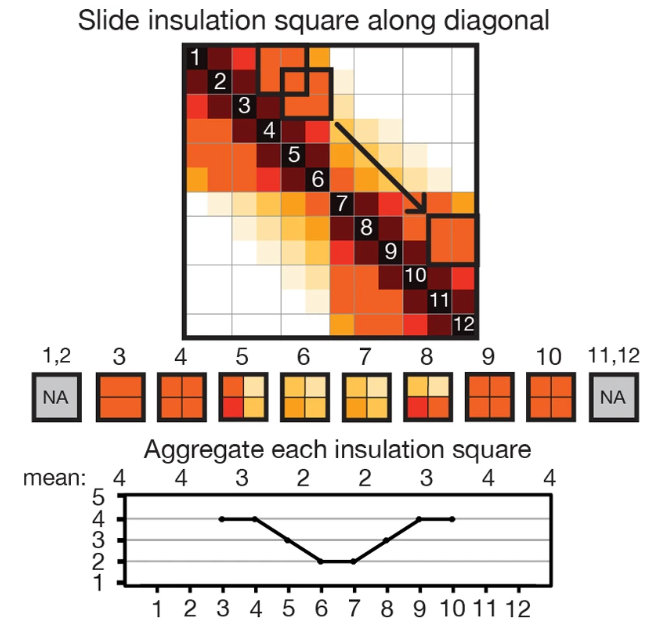
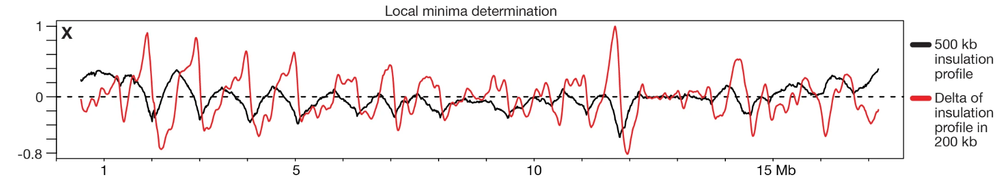
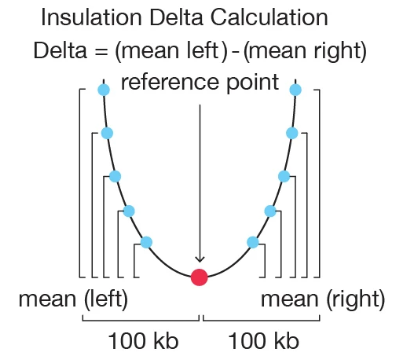

### Tips
+ 拓扑相关结构域（Topologically associating domains，简称TAD），是已被显微成像技术确认的染色质结构，在Hi-C数据的heatmap上表现为一个个几百Kb到几Mb范围的三角。
+ 鉴定TAD的算法有很多并且不断更新中，这里推荐两种比较常用的:\
(1) Directionality index(DI) 通过计算具有方向性的系数，表示上下游一定区域的互作数变化大小，来区分TAD内部和边界，并通过隐马可夫模型鉴定TAD;   \
(2) Insulation score(IS) 是计算每个位置的绝缘系数，在局部区域中绝缘分数最大的即为TAD的边界boundary，人为设定阈值，定义boundary之间为TAD。
+ 需要注意算法中涉及很多参数，脚本中是默认参数，可根据需要进行调整。

### 互作方向指数(Directionality index, DI)基本原理
 \
(Dixon, J., Selvaraj, S., Yue, F. et al. Topological domains in mammalian genomes identified by analysis of chromatin interactions. Nature 485, 376–380 (2012).) \
Dixon等人在文章中使用的方法即是DI法，首先他们在互作热图上观察到了一个个类似小方块的结构域，利用RNA-seq，ChIP-seq等一系列数据对这些结构域中的组蛋白，CTCF结合位点，基因表达水平进行分析之后，发现在这些区域的边界处，有较为明显的特征，包括组蛋白修饰和CTCF富集，基因表达水平高等，并且TAD内部互作的强度显著高于TAD间的互作，因此他们认为这些小方块可能是一个个小的互作单元。而根据TAD边界处的蛋白富集情况，他们推测可能正是这些因子促使了TAD结构的形成。\
**互作方向指数，核心思想是判断每个 bin在基因组上更倾向于与上游还是下游区域交互，用这种“方向性偏好”来确定边界。**\
每个bin的DI值是通过上游2M范围内所有的reads数目(A)和下游2M范围内所有的reads数(B)与两者的平均值(E)之间的比较得到的。\
 \
由于每个bin都可能与其它bin有一定互作关系，而实际测序过程中有的区域没有被覆盖到以及某些区域的测序偏好性，此时得到的DI值也会存在偏好。\
因此还需要利用HMM(hiddenMarkov model)模型，以目前的DI值为对照，得到更为准确的方向指数。\
 \
最终对得到的HMM形式的结果进行提取，每一个TAD都从倾向于下游互作的bin开始，一直到一个倾向于下游互作的bin结束。得到的区域也就是一个TAD，一直到染色体的最终bin为止。
#### Step1.HicPro互作矩阵（SAMPLE_iced_matrix）转为DI Input格式
~~~
python环境中需pandas及iced
HiCPro_anno=/home/share/HiC-Pro-annotations/

python /usr/local/software/HiC-Pro-3.1.0/bin/utils/sparseToDense.py HicProRes/SAMPLE_iced_matrix -b $HiCPro_anno/40000_mm10.bed -o 01.sparseToDense/SAMPLE.mat --perchr -d
~~~
#### Step2.DI_score
~~~
DI=/home/share/software/HiC/Domaincaller/1DI_from_matrix.pl
res=40000
length=2000000

for i in {1..19} X Y ;do 
perl $DI 01.sparseToDense/chr${i}_SAMPLE.mat $res $length $HiCPro_anno/chrom_mm10.sizes > 02.DI_score/chr${i}_SAMPLE.di 
done

合并DI
cat 02.DI_score/*di|awk -v OFS="\t" '$1~/[0-9]+/{$0=$0;print} $1~"X"{$1=20;print} $1~"Y"{$1=21;print} ' | sort -k1n,1 -k2n,2 > 02.DI_score/SAMPLE.di

DI转bedGraph chr20/21换回X/Y；不要空行
awk -F "\t" -v OFS="\t" '$1==20{$1="X"} $1==21{$1="Y"} $1==""||$2==""||$3==""||$4==""{next} {$1="chr"$1;print}' 
02.DI_score/SAMPLE.di|sort -k1V,1 -k2n,2 > 02.DI_score/SAMPLE.bedGraph
~~~
#### Step3.HMM
HMM建模 matlab本地运行
编辑HMM_calls.m文件：
更改module地址，di文件地址
#### 04.post_processing
mkdir -p 04.post_processing/OM_LT_Hic_LPS90min
perl $domainCall/file_ends_cleaner.pl 03.HMM/OM_LT_Hic_LPS90min.hmm 02.DI_score/OM_LT_Hic_LPS90min/OM_LT_Hic_LPS90min.di| \
perl $domainCall/converter_7col.pl > 04.post_processing/OM_LT_Hic_LPS90min/OM_LT_Hic_LPS90min_hmm_7colfile
cd 04.post_processing
mkdir OM_LT_Hic_LPS90min/chr_split/
for j in {1..21};do awk -F "\t" -v chr=chr${j} '$1==chr' OM_LT_Hic_LPS90min/OM_LT_Hic_LPS90min_hmm_7colfile > \
OM_LT_Hic_LPS90min/chr_split/chr${j}_OM_LT_Hic_LPS90min_hmm_7colfile;done
mkdir OM_LT_Hic_LPS90min/chr_split/Raw_TAD
for j in {1..21};do \
perl $domainCall/hmm_probablity_correcter.pl OM_LT_Hic_LPS90min/chr_split/chr${j}_OM_LT_Hic_LPS90min_hmm_7colfile 2 0.99 40000| \
perl $domainCall/hmm-state_caller.pl ~/ann/hic/ConfigHP/mm10_change_chr.chrom.sizes chr${j} |\
perl $domainCall/hmm-state_domains.pl > OM_LT_Hic_LPS90min/chr_split/Raw_TAD/res.${j}.tad;done
##others
#去除一些错误的TAD
#将TAD的方向换成正的 #将TAD的chr20/21换成X/Y #不要空行
mkdir OM_LT_Hic_LPS90min/chr_split/TAD
cat OM_LT_Hic_LPS90min/chr_split/Raw_TAD/*tad| \
awk -v OFS="\t" '{chrs[$1]} $2>$3{t=$2;$2=$3;$3=t;} $1=="chr20"{$1="chrX"} $1=="chr21"{$1="chrY"} $1==""||$2==""||$3==""{next} {$0=$0;print}'| \
sort -k1V,1 -k2n,2 > OM_LT_Hic_LPS90min/chr_split/TAD/OM_LT_Hic_LPS90min.tad
# 去除重叠的TAD中的大的，便于计算
mkdir OM_LT_Hic_LPS90min/chr_split/TAD/unoverlap
awk -v OFS="\t" 'NR>1&&(a!=$1||c<=$2){print a,b,c} {a=$1;b=$2;c=$3} END{print a,b,c}' \
OM_LT_Hic_LPS90min/chr_split/TAD/OM_LT_Hic_LPS90min.tad > OM_LT_Hic_LPS90min/chr_split/TAD/unoverlap/OM_LT_Hic_LPS90min.tad

### 互作隔绝指数(Insulation score, IS)
Crane等人在2015年的Nature文章中使用了互作隔绝指数来识别TAD，这种分析方法需要计算染色体上局部区域的互作强度值之和，TAD边界处的局部总互作相对较低，进行平滑变换后，“波谷”区即为TAD边界。\
(Crane, E., Bian, Q., McCord, R. et al. Condensin-driven remodelling of X chromosome topology during dosage compensation. Nature 523, 240–244 (2015).)\
Insulation score识别TAD主要分为两步，即计算各个bin的互作强度和识别边界区域。\
第一步，计算各个bin的互作强度主要是选取一个window，然后将每个bin内的互作强度相加(也就是唯一比对到这些区域的read pairs数目)，得到每个bin的互作强度值。\
 \
第二步则是通过每个bin的互作强度来识别边界，将每个bin的互作强度值作为value，画出其在染色体上的波动曲线，波谷处就是需要识别的边界。\
 \
上图中黑色线代表的是每个bin中互作强度值的曲线，为了识别出黑色曲线中的波谷，方法中又定义了一个window，对每个bin内的insulation值计算delta值，最终红色曲线中经过X轴的坐标即为insulation score值曲线的波谷，也就是TAD边界的位置。\
 \
#### Step1.convert_3col_to_matrix
for i in {1..19} X Y ;do chr=chr${j}; \
nohup python convert_3col_to_matrix_for_cworld.py -i $YM_iced_mat_repmerge/${i}/iced/40000/${i}_40000_iced.matrix \
-I $ConfigHP/40000_mm10.bed -c $chr -o ${i}/${chr}.mat > ${i}/logs/${chr}.log & done;done

#02.matrix2insulation
for i in LT ST;do mkdir 02.matrix2insulation/${i};for j in {1..19} X Y ;do chr=chr${j};\
nohup perl -I /home2/xycui/HIC/software/cworld-dekker-master/lib/ $cworld/matrix2insulation.pl --is 1000000 --ids 200000 --nt 0.1 --bmoe 3 \
-i 01.convert_3col_to_matrix/${i}/${chr}.mat -o 02.matrix2insulation/${i}/${chr} & done;done

#03.insulation2tads
for i in LT ST;do mkdir 03.insulation2tads/${i};for j in {1..19} X Y;do chr=chr${j}; \
nohup perl -I /home2/xycui/HIC/software/cworld-dekker-master/lib/ $cworld/insulation2tads.pl -i 02.matrix2insulation/${i}/${chr}--*insulation \
-b 02.matrix2insulation/${i}/${chr}--*boundaries -o 03.insulation2tads/${i}/${chr} --mbs 0.25 & done;done

cd 02.matrix2insulation
for i in LT ST;do cd $i;mkdir logs;mkdir boundaries;mkdir picture;mkdir insulation;\
mv *log logs/;mv *.boundaries* boundaries/;mv *png picture/;mv *pdf picture/;mv *.insulation* insulation/;cd ../;done

for i in LT ST;do
cat 02.matrix2insulation/${i}/boundaries/chr*boundaries.bed | awk -v OFS="\t" '$1~/^chr/{print}' | sort -k1V,1 -k2n,2 > 1.cat_boundary/${i}.bed
cat 02.matrix2insulation/${i}/insulation/chr*bedGraph | awk -v OFS="\t" '$1~/^chr/{if($4=="NaN")$4=0;print}' | sort -k1V,1 -k2n,2 > 2.cat_insulation/${i}.bedGraph
cat 03.insulation2tads/${i}/chr*bedGraph | awk -v OFS="\t" '$1~/^chr/{if($4=="NaN")$4=0;print}' | sort -k1V,1 -k2n,2 > 3.cat_tad/${i}.tad
done