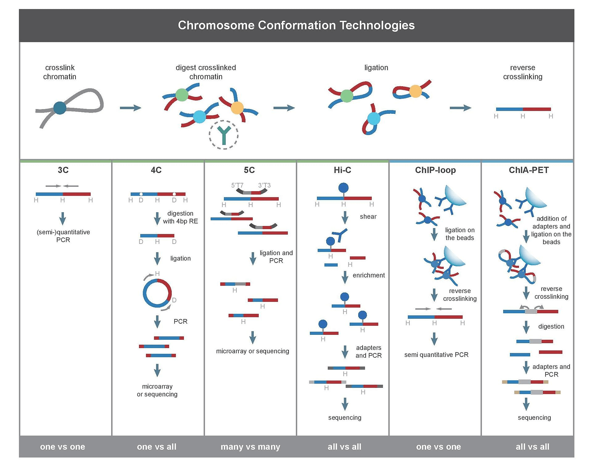
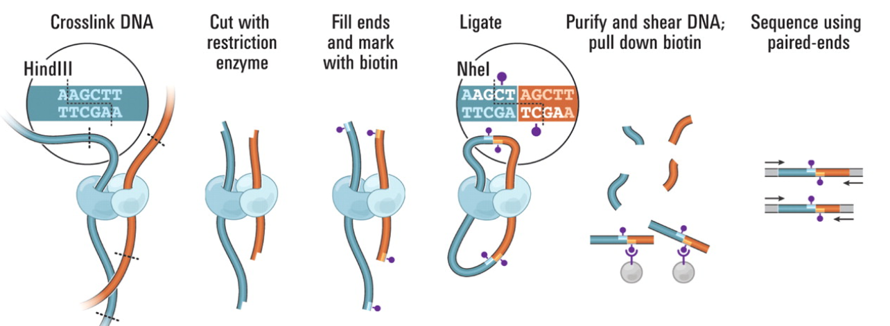
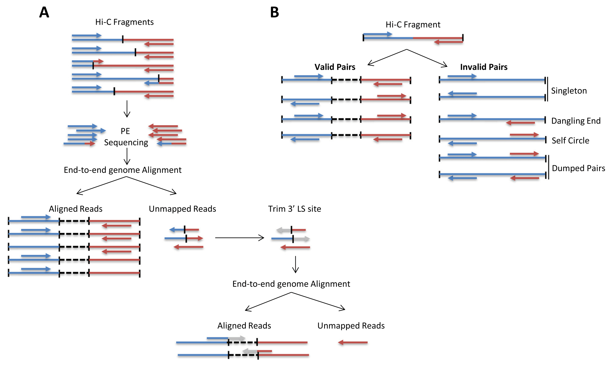
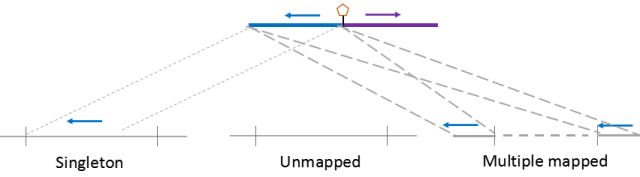
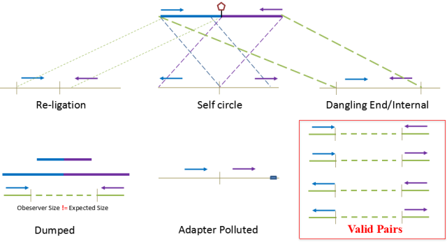

# The 3D genome profiling of murine long term hematopoietic stem cells (LT-HSCs)
* This repository contains code from data analysis of Hi-C.
## Code description
1.HicPro.md | From fastq to contact matrix\
Code contains functions for preprocessing and alignment steps of HiC dataset.\
2.Compartment.md|Code contains functions for\
3.TAD.md\
4.Loop.md\
5.Probability.md\
6.Visualization.md
## 目前主流三维基因组测序技术

+ C技术\
**3C(一对一)**：基因组捕获技术(Chromosome conformation capture，3C)是最早研究三维基因组的技术,需要提前知道互相作用区域，才能量化口一对基因组基因座之间的互相作用。\
**4C(一对多)**：染色体构象捕获芯片(Chromosome conformation capture-on-chip，4C)，可以捕获一个基因区域其他区域间的互相作用。该技术不需要知道作用区域的先验知识就可以使用。\
**5C(多对多)**：染色体构象捕获碳拷贝(Chromosome conformation capture carbon园 copy，5C)，可以检测某段区域内所有的互作，但是该区域一般<1 Mb。覆盖度的问题也就造成该技术不适用于全基因组测序。\
**Hi-C(全部互作)**：高通量基因组捕获技术，基本解决了上述技术的缺点，可以实现全基因组覆盖检测全部未知互作区域。
+ 基于免疫沉淀技术\
**ChlP-loop**：该技术将 3C 与 ChlP-seg 结合，可以检测目的蛋白质介导的两个目的基因区域互作。\
**ChIA-PET**：该技术将 HiC 与 ChIP-seg 结合，可以检测目的蛋白质的所有互相作用。
## HiC技术的大致流程
Hi-C是高通量染色体构象捕获（High-throughput Chromosome Conformation Capture, Hi-C）技术的简称，通过高通量测序检测基因组不同位置可能存在的空间互作（contacts），研究全基因组范围内整个染色质DNA在空间位置上的关系。\
由Job Dekker实验室从3C技术延伸开发。具体的实验流程方法原理建议从Job Dekker的几篇文章和综述开始了解： \
van Berkum NL, Lieberman-Aiden E, Williams L, et al. Hi-C: a method to study the three-dimensional architecture of genomes. J Vis Exp. 2010;(39):1869. doi:10.3791/1869 \
\
1.通过甲醛交联固定，将细胞内由蛋白质介导的空间上邻近的染色质片段进行共价连接。\
2.限制性内切酶进行酶切。\
3.使用生物素标记末端标记。\
4.将连接的DNA纯化后超声打断，并用生物素亲和层析，将生物素化的DNA片段分离，加上接头进行高通量测序。
## HiC文库比对
  HiC-Pro是一款高效的Hi-C数据分析软件，提供了从原始数据到归一化之后的Hi-C图谱构建的完整功能，运行效率高，用法简便。
Hi-C标准文库是标准的Chimera结构，在将两端序列进行比对到基因组上时，理论上两侧pairends可以分别比对到基因组的两个位置。\
由于DNA在碎片化过程中，剪切是随机的，因此酶切位点末端补平形成的junction fragment很可能分布在一侧的reads中，常规的比对分析是很难处理chimera的。\
在HiC-Pro和HiCUP软件中，他们会去识别理论的junction fragment。如HiC-Pro在比对时先进行Global Mapping，后将unmapping的reads用junction fragment序列进行识别并切割，再进行local mapping，最终将数据进行合并（下图A）。
\
在实际比对中即使采用两步比对方式，仍有可能是只有一端序列能比对到基因组中，另外一端无法识别到基因组中，这种情况我们将其归类为**Singleton**。它产生的原因可能有①adapter污染（先前数据没进行过滤）；②另一侧数据质量较差，多数为N的区域；③DNA片段被降解或酶切反应产生星号活性。同时片段过短，150碱基已经读通了生物素标记的位点，但是该位点不是正常的junction fragment。在植物样本中，singleton较为常见，可能与细胞壁破碎不完全，部分细胞质成分进入到反应体系影响酶切有关。\
有些植物的基因组存在大量的重复序列，如玉米中85%的序列被认为是重复序列。这对要求两端都要唯一比对的HiC而言是巨大的挑战，一旦有一段比对到两个或两个以上的位点，该reads就将被归类到**Multiple mapped reads**中。\
如果在比对过程中，global mapping 和 local mapping均无法将序列识别到特定的位点，这种序列会被归类到**Unmapped reads**。它可能产生的原因是基因组的组装完整度较差，基因组中存在大量的gap无法识别，被填充为NNNNN。另一个原因是酶切片段较碎，多个酶切片段连接在一起，无法识别到特定座位。\
如果两侧数据都能比对到基因组的数据会被统一认为是**Unique mapped reads**，此时对于动物基因组，unique mapped reads 占测序量（clean reads）50%以上应是可接受的范围。对于植物样本，尤其是重复序列较多的样本，unique mapped reads 比例可能会急剧降低。\
在获取unique mapped reads后，要进行进一步过滤，以识别真正有效的interaction reads。\
## 三种比对过程识别的无效数据
\
根据HiC实验的基本原理PLA(proximity ligation assay)：空间上相互靠近的片段更有机会被连接在一起。因此仅且仅有两个来源不同的片段连接在一起才会被认为是标准的文库片段。而这片段是指利用限制性内切酶酶切的Fragments，即唯有两个片段能分别比对到两个不同的酶切片段上，且实际片段大小（observe）符合理论的片段大小，在分析是才会将其归类到valid pairs中。\
## Hi-C数据过滤
\
因此在分析过程中会将部分无效的数据进行过滤，首先是如果两个片段原本通过一个酶切位点连接在一起，在HiC文库中如果该片段即使酶切后添加生物素仍然连接在一起，该片段会被归类到**Re-ligation reads**中；
而如果两个的reads比对到同一个fragment，但是方向相反，则该reads会被认为是首尾相连形成了**Self-circle**；\
如果pair end 同时比对到一个酶切片段上，则该片段会被认为是**Dangling ends**；\
如果有一个发现是adapter污染，该reads会被认为是**Adapter polluted**;\
如果两侧的end均能比对到基因组的两个酶切片段中，但是观测到的片段大小与理论的片段大小不一致，则该片段会认为是错误连接而被归类为**Dumped reads**；\
只有比对到两个酶切片段且片段的理论值等于实际值的reads，才会被认为是**Valid pair reads**。\
获得了interaction reads后，要去除文库中完全一样的reads，因为这部分可能是由于PCR扩增导致的**Duplication**，去除Duplication后，Valid pairs数据可用于后续的滑bin统计分析了。
+ **Dangling ends** 主要来源于两部分，①经DNA连接酶连接反应后，携带生物素的DNA片段末端并未形成嵌合片段，在末端生物素切割的（klenow）时又未将末端的生物素去除，从而进入到最终的文库中；②磁珠洗脱步骤未完全将非特异性结合的DNA洗脱下来。
+ **Dumped reads**的主要原因在于酶的星号活性导致切割位点不在经典的位点，这有可能是酶切时间过长或反应体系中盐离子浓度和种类不合适导致的；另外一个原因是片段被DNA外切酶降解，使得片段的大小发生了改变。
